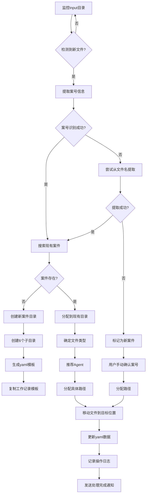

# 案件智能识别系统设计方案

> Last updated: 2025-11-01
> 本文档设计智能识别系统，自动识别案件、分配文档路径，确保每个文档都能准确归类到正确的案件文件夹中。

## 1. 概述

案件智能识别系统是SuitAgent文档管理的核心组件，负责监听input目录的新增文件，自动识别文件所属案件，并将文件分配到正确的案件目录中。系统支持多案件并行处理，自动创建新案件目录，智能处理冲突情况。

### 1.1 系统目标

- **自动案件识别**：从文档中自动提取案号并识别案件
- **智能路径分配**：根据文档类型和案件信息分配到正确目录
- **多案件支持**：同时处理多个案件的文件，自动分类归档
- **新案件创建**：自动创建新案件的完整目录结构
- **冲突智能处理**：检测并处理重复案件和文件冲突

### 1.2 系统架构

```
┌─────────────────────────────────────────────────────────────┐
│                    案件智能识别系统                            │
├─────────────────────────────────────────────────────────────┤
│                                                             │
│  输入监听  →  案件识别  →  路径分配  →  文件放置  →  确认     │
│     ↓          ↓          ↓          ↓          ↓           │
│  监控input   提取案号   确定目标    移动文件   记录日志     │
│     ↓          ↓          ↓          ↓          ↓           │
│  文件检测   案件匹配   Agent推荐   更新yaml   发送通知     │
└─────────────────────────────────────────────────────────────┘
```

## 2. 核心算法设计

### 2.1 案号识别算法

**正则表达式模式**：
```regex
\[(\d{4})\]([京津沪渝冀豫云辽黑湘皖鲁新苏浙赣鄂桂甘晋蒙陕吉闽贵粤青藏川宁琼使领][a-zA-Z0-9]*)(民初|行初|刑初|民终|行终|刑终)\d+号
```

**支持格式**：
- 标准格式：`[2025]京0105民初1234号`
- 简化格式：`[2025]民初1234号`
- 无方括号：`2025京0105民初1234号`

**案号信息提取**：
```yaml
case_number_info:
  year: "2025"                    # 年份
  region_code: "京0105"           # 地区代码
  region_name: "北京"             # 地区名称
  case_type: "民初"               # 案件类型：民初/行初/刑初/民终/行终/刑终
  sequence: "1234"                # 序号
  full_number: "[2025]京0105民初1234号"  # 完整案号
```

**地区代码映射**：
```yaml
region_mapping:
  "京": "北京"
  "津": "天津"
  "沪": "上海"
  "渝": "重庆"
  "冀": "河北"
  "豫": "河南"
  "云": "云南"
  "辽": "辽宁"
  "黑": "黑龙江"
  "湘": "湖南"
  "皖": "安徽"
  "鲁": "山东"
  "新": "新疆"
  "苏": "江苏"
  "浙": "浙江"
  "赣": "江西"
  "鄂": "湖北"
  "桂": "广西"
  "甘": "甘肃"
  "晋": "山西"
  "蒙": "内蒙古"
  "陕": "陕西"
  "吉": "吉林"
  "闽": "福建"
  "贵": "贵州"
  "粤": "广东"
  "青": "青海"
  "藏": "西藏"
  "川": "四川"
  "宁": "宁夏"
  "琼": "海南"
```

### 2.2 文件类型识别算法

**文档类型识别规则**：

| 文档类型 | 识别关键词 | 文件特征 | 推荐Agent |
|----------|------------|----------|-----------|
| **起诉状** | "原告"、"被告"、"诉讼请求" | 包含完整当事人信息 | DocAnalyzer |
| **答辩状** | "答辩人"、"被答辩人"、"答辩请求" | 回应起诉内容 | DocAnalyzer |
| **证据材料** | "证据"、"附件"、"证明目的" | 证据清单或证明文件 | EvidenceAnalyzer |
| **庭审笔录** | "庭审"、"审判员"、"当事人" | 庭审过程记录 | DocAnalyzer |
| **判决书** | "判决"、"裁定"、"法院认为" | 法院审理结果 | DocAnalyzer |
| **传票** | "传票"、"开庭时间"、"审判员" | 法院出庭通知 | Scheduler |
| **举证通知书** | "举证"、"期限"、"证据要求" | 证据提交期限 | Scheduler |
| **送达回证** | "送达回证"、"送达证明" | 送达确认文件 | Scheduler |
| **代理词** | "代理词"、"代理意见" | 庭审代理意见 | Writer |
| **质证意见书** | "质证"、"证据效力" | 证据质证意见 | EvidenceAnalyzer |
| **申请书** | "申请"、"请求法院" | 申请类文书 | Writer |
| **律师函** | "律师函"、"催告" | 非诉文书 | Writer |

**文件扩展名识别**：
```yaml
file_extension_mapping:
  ".pdf": "PDF文档"
  ".docx": "Word文档"
  ".doc": "Word文档(旧版)"
  ".xlsx": "Excel表格"
  ".xls": "Excel表格(旧版)"
  ".txt": "文本文件"
  ".zip": "压缩包"
  ".jpg": "图片文件"
  ".png": "图片文件"
```

### 2.3 案件匹配算法

**匹配流程**：
```
输入文件 → 案号提取 → 检查现有案件 →

案件存在：
├─ 案号完全匹配 → 直接分配
├─ 案号部分匹配 → 提示确认
└─ 无匹配 → 新案件处理

案件不存在：
└─ 创建新案件 → 自动分配
```

**匹配规则**：
- **完全匹配**：案号完全一致，优先匹配
- **部分匹配**：案号部分匹配，需要人工确认
- **模糊匹配**：基于地区、类型、序号模糊匹配

**匹配示例**：
```
输入案号：[2025]京0105民初1234号

完全匹配：
├─ 找到：[2025]京0105民初1234号 → 直接分配

部分匹配：
├─ 找到：[2025]京民初1234号 → 部分匹配
└─ 提示：是否归类到[2025]京民初1234号案件？

模糊匹配：
├─ 找到：[2025]京民初1235号 → 序号相近
└─ 提示：是否创建新案件[2025]京0105民初1234号？
```

## 3. 系统工作流程

### 3.1 完整工作流程图



### 3.2 详细步骤说明

#### 步骤1：输入文件监听
```python
def monitor_input_directory():
    """监听input目录的新增文件"""
    watched_files = get_watched_files()

    while True:
        current_files = list_files("input/")

        for file in current_files:
            if file not in watched_files:
                process_new_file(file)
                watched_files.append(file)

        time.sleep(1)  # 每秒检查一次
```

#### 步骤2：案号提取
```python
def extract_case_number(file_content, filename):
    """从文件内容或文件名中提取案号"""

    # 1. 从文件内容提取
    case_number = extract_from_content(file_content)
    if case_number:
        return validate_case_number(case_number)

    # 2. 从文件名提取
    case_number = extract_from_filename(filename)
    if case_number:
        return validate_case_number(case_number)

    # 3. 无法提取，返回None
    return None

def extract_from_content(content):
    """从文件内容中提取案号"""
    patterns = [
        r'\[(\d{4})\]([京津沪渝冀豫云辽黑湘皖鲁新苏浙赣鄂桂甘晋蒙陕吉闽贵粤青藏川宁琼使领][a-zA-Z0-9]*)(民初|行初|刑初|民终|行终|刑终)\d+号',
        r'(\d{4})[京津沪渝冀豫云辽黑湘皖鲁新苏浙赣鄂桂甘晋蒙陕吉闽贵粤青藏川宁琼使领][a-zA-Z0-9]*[民行刑](?:初|终)\d+号'
    ]

    for pattern in patterns:
        match = re.search(pattern, content)
        if match:
            return standardize_case_number(match.group(0))

    return None
```

#### 步骤3：案件匹配
```python
def find_matching_case(case_number):
    """查找匹配的现有案件"""

    if not case_number:
        return None

    # 1. 完全匹配
    exact_match = find_exact_match(case_number)
    if exact_match:
        return exact_match

    # 2. 部分匹配
    partial_matches = find_partial_matches(case_number)
    if len(partial_matches) == 1:
        return partial_matches[0]
    elif len(partial_matches) > 1:
        return partial_matches  # 返回多个匹配供选择

    # 3. 无匹配
    return None

def find_exact_match(case_number):
    """查找完全匹配的案件"""
    case_dirs = list_case_directories()

    for case_dir in case_dirs:
        if case_dir == standardize_directory_name(case_number):
            return case_dir

    return None
```

#### 步骤4：新案件创建
```python
def create_new_case(case_number):
    """创建新案件目录结构"""

    case_dir = standardize_directory_name(case_number)
    base_path = f"output/{case_dir}"

    # 创建主目录
    os.makedirs(base_path, exist_ok=True)

    # 创建6个子目录
    subdirs = [
        "01_案件分析",
        "02_法律研究",
        "03_证据材料",
        "04_法律文书",
        "05_综合报告",
        "06_日程管理"
    ]

    for subdir in subdirs:
        os.makedirs(f"{base_path}/{subdir}", exist_ok=True)

    # 创建Writer子目录
    writer_subdirs = [
        "起诉状", "答辩状", "代理词", "质证意见书",
        "申请书", "上诉状", "律师函", "调解协议",
        "保全申请", "执行申请", "法律意见书", "其他文书"
    ]

    for subdir in writer_subdirs:
        os.makedirs(f"{base_path}/04_法律文书/{subdir}", exist_ok=True)

    # 创建Scheduler子目录
    scheduler_subdirs = [
        "日程安排", "工时统计", "期限提醒"
    ]

    for subdir in scheduler_subdirs:
        os.makedirs(f"{base_path}/06_日程管理/{subdir}", exist_ok=True)

    # 生成yaml模板
    generate_yaml_template(case_dir)

    # 复制工作记录模板
    copy_work_template(case_dir)

    return base_path
```

#### 步骤5：文件类型识别
```python
def identify_document_type(file_content, filename):
    """识别文档类型"""

    # 1. 基于文件扩展名
    ext = get_file_extension(filename)
    if ext in [".docx", ".doc"]:
        return "Word文档"
    elif ext in [".pdf"]:
        return "PDF文档"
    elif ext in [".xlsx", ".xls"]:
        return "Excel表格"
    elif ext in [".zip"]:
        return "压缩包"

    # 2. 基于文件内容关键词
    content_type = identify_by_content(file_content)
    if content_type:
        return content_type

    # 3. 基于文件名
    name_type = identify_by_filename(filename)
    if name_type:
        return name_type

    return "未知类型"

def identify_by_content(content):
    """基于内容识别文档类型"""

    type_keywords = {
        "起诉状": ["原告", "被告", "诉讼请求", "此致"],
        "答辩状": ["答辩人", "被答辩人", "答辩请求"],
        "证据材料": ["证据目录", "证据清单", "证明目的"],
        "庭审笔录": ["庭审", "审判员", "当事人", "法庭调查"],
        "判决书": ["判决", "裁定", "法院认为", "判决如下"],
        "传票": ["传票", "开庭时间", "审判员"],
        "举证通知书": ["举证", "期限", "证据要求"],
        "律师函": ["律师函", "催告", "警告"]
    }

    for doc_type, keywords in type_keywords.items():
        match_count = sum(1 for keyword in keywords if keyword in content)
        if match_count >= 2:  # 至少匹配2个关键词
            return doc_type

    return None
```

#### 步骤6：Agent推荐
```python
def recommend_agent(document_type):
    """根据文档类型推荐Agent"""

    agent_mapping = {
        "起诉状": ["DocAnalyzer", "IssueIdentifier", "Researcher"],
        "答辩状": ["DocAnalyzer", "IssueIdentifier", "Strategist", "Writer"],
        "证据材料": ["EvidenceAnalyzer", "DocAnalyzer"],
        "庭审笔录": ["DocAnalyzer", "IssueIdentifier", "Strategist"],
        "判决书": ["DocAnalyzer", "Researcher", "Strategist"],
        "传票": ["Scheduler"],
        "举证通知书": ["Scheduler", "EvidenceAnalyzer"],
        "律师函": ["Strategist", "Writer"],
        "代理词": ["Writer", "Researcher"],
        "质证意见书": ["EvidenceAnalyzer", "Writer"],
        "申请书": ["Writer", "Strategist"]
    }

    return agent_mapping.get(document_type, ["DocAnalyzer"])
```

#### 步骤7：路径分配
```python
def determine_output_path(case_dir, document_type, agent_recommendations):
    """确定文件输出路径"""

    agent_path_mapping = {
        "DocAnalyzer": "01_案件分析",
        "Strategist": "01_案件分析",
        "IssueIdentifier": "02_法律研究",
        "Researcher": "02_法律研究",
        "EvidenceAnalyzer": "03_证据材料",
        "Summarizer": "05_综合报告",
        "Reporter": "05_综合报告",
        "Scheduler": "06_日程管理"
    }

    # 选择主要Agent（推荐列表中的第一个）
    primary_agent = agent_recommendations[0] if agent_recommendations else "DocAnalyzer"

    output_dir = agent_path_mapping.get(primary_agent, "05_综合报告")

    # Writer需要进一步细分
    if primary_agent == "Writer":
        subdir = determine_writer_subdir(document_type)
        output_dir = f"04_法律文书/{subdir}"

    full_path = f"output/{case_dir}/{output_dir}"

    return full_path

def determine_writer_subdir(document_type):
    """确定Writer的子目录"""

    writer_mapping = {
        "起诉状": "起诉状",
        "答辩状": "答辩状",
        "代理词": "代理词",
        "质证意见书": "质证意见书",
        "申请书": "申请书",
        "上诉状": "上诉状",
        "律师函": "律师函",
        "调解协议": "调解协议",
        "保全申请": "保全申请",
        "执行申请": "执行申请",
        "法律意见书": "法律意见书"
    }

    return writer_mapping.get(document_type, "其他文书")
```

#### 步骤8：文件移动与更新
```python
def move_file_to_target(source_file, target_path, case_dir):
    """移动文件到目标位置并更新yaml"""

    # 1. 生成目标文件名
    target_filename = generate_standard_filename(source_file, case_dir)
    target_full_path = f"{target_path}/{target_filename}"

    # 2. 移动文件
    shutil.move(source_file, target_full_path)

    # 3. 更新yaml数据
    update_yaml_data(case_dir, source_file, target_full_path)

    # 4. 记录操作日志
    log_operation(case_dir, source_file, target_full_path)

    return target_full_path

def update_yaml_data(case_dir, source_file, target_file):
    """更新案件yaml数据"""

    yaml_path = f"output/{case_dir}/06_日程管理/{case_dir}.yaml"

    if os.path.exists(yaml_path):
        with open(yaml_path, 'r', encoding='utf-8') as f:
            data = yaml.load(f, Loader=yaml.FullLoader)

        # 更新document_status部分
        doc_info = extract_file_info(target_file)
        data['document_status']['pending_documents'].append(doc_info)

        # 更新last_modified_date
        data['system_info']['last_modified_date'] = datetime.now().strftime('%Y-%m-%d')

        with open(yaml_path, 'w', encoding='utf-8') as f:
            yaml.dump(data, f, default_flow_style=False, allow_unicode=True)
```

## 4. 冲突处理机制

### 4.1 重复案件检测

**检测场景**：
- 案号完全相同
- 案号格式略有差异
- 当事人信息相同但案号不同

**处理策略**：
```python
def handle_duplicate_case(case_number, detected_files):
    """处理重复案件"""

    existing_cases = find_cases_by_case_number(case_number)

    if len(existing_cases) == 1:
        # 只有一个匹配，案号格式略有差异
        return merge_case_files(existing_cases[0], detected_files)

    elif len(existing_cases) > 1:
        # 多个匹配，需要用户确认
        return prompt_user_confirmation(existing_cases, detected_files)

    else:
        # 无匹配，创建新案件
        return create_new_case(case_number)
```

### 4.2 文件冲突处理

**冲突类型**：
- 相同文件名已存在
- 相同内容文件重复
- 不同版本文件冲突

**处理选项**：
```python
conflict_resolution_options = {
    "overwrite": "覆盖现有文件",
    "rename": "重命名新文件",
    "skip": "跳过不处理",
    "merge": "合并内容",
    "version": "创建新版本"
}

def resolve_file_conflict(source_file, target_path):
    """解决文件冲突"""

    if not os.path.exists(target_path):
        return "overwrite"

    # 检测文件内容是否相同
    if files_are_identical(source_file, target_path):
        return "skip"  # 内容相同，跳过

    # 检测文件名是否相同
    if get_filename(source_file) == get_filename(target_path):
        return "rename"  # 重命名避免覆盖

    # 其他情况，提示用户选择
    return prompt_user_choice()
```

## 5. 系统配置

### 5.1 配置文件

```yaml
# intelligent_case_recognition.yaml
system_config:
  monitoring:
    input_directory: "input"
    check_interval: 1  # 秒
    file_types: [".pdf", ".docx", ".doc", ".xlsx", ".txt", ".zip"]

  recognition:
    case_number_patterns:
      - '\[(\d{4})\]([京津沪渝冀豫云辽黑湘皖鲁新苏浙赣鄂桂甘晋蒙陕吉闽贵粤青藏川宁琼使领][a-zA-Z0-9]*)(民初|行初|刑初|民终|行终|刑终)\d+号'
      - '(\d{4})[京津沪渝冀豫云辽黑湘皖鲁新苏浙赣鄂桂甘晋蒙陕吉闽贵粤青藏川宁琼使领][a-zA-Z0-9]*[民行刑](?:初|终)\d+号'

    confidence_threshold: 0.8  # 案号识别置信度阈值

  processing:
    auto_create_case: true  # 自动创建新案件
    auto_update_yaml: true  # 自动更新yaml
    generate_logs: true  # 生成处理日志

  conflict_resolution:
    default_action: "prompt"  # 冲突默认处理方式
    enable_user_confirmation: true  # 启用用户确认
```

### 5.2 日志配置

```python
# 日志配置
LOGGING_CONFIG = {
    'version': 1,
    'disable_existing_loggers': False,
    'formatters': {
        'standard': {
            'format': '%(asctime)s [%(levelname)s] %(name)s: %(message)s'
        },
    },
    'handlers': {
        'default': {
            'level': 'INFO',
            'formatter': 'standard',
            'class': 'logging.FileHandler',
            'filename': 'logs/intelligent_case_recognition.log',
            'mode': 'a',
        },
    },
    'loggers': {
        '': {
            'handlers': ['default'],
            'level': 'INFO',
            'propagate': False
        }
    }
}
```

## 6. 监控与告警

### 6.1 处理统计

```python
def generate_processing_report():
    """生成处理统计报告"""

    return {
        "total_files_processed": 0,
        "successful_files": 0,
        "failed_files": 0,
        "new_cases_created": 0,
        "files_assigned": 0,
        "conflicts_detected": 0,
        "processing_time": 0.0,
        "average_processing_time": 0.0
    }
```

### 6.2 异常处理

```python
def handle_exception(exception_type, file_info):
    """处理异常情况"""

    error_handling = {
        "file_not_found": "文件未找到，跳过处理",
        "permission_denied": "权限不足，跳过文件",
        "yaml_update_failed": "更新yaml失败，手动处理",
        "directory_creation_failed": "创建目录失败，检查权限",
        "pattern_match_failed": "案号识别失败，标记为新案件"
    }

    message = error_handling.get(exception_type, "未知错误")
    log_error(file_info, exception_type, message)

    return message
```

## 7. YAML数据模板

### 7.1 模板概述

智能案件识别系统创建的YAML数据总表模板包含16个核心部分，支持案件全生命周期数据管理和可视化展示。

### 7.2 完整模板结构

```yaml
# 案件数据总表模板
# 用于案件进度看板和数据分析

# 1. 案件基本信息
case_basic_info:
  case_id: "[2025]京0105民初1234号"
  case_title: "合同纠纷案"
  case_type: "合同纠纷"
  court_level: "一审"
  court_name: "北京市海淀区人民法院"
  case_status: "审理中"
  priority: "高"
  create_date: "2025-03-15"
  last_update: "2025-03-20"

# 2. 当事人信息
parties_info:
  plaintiff:
    name: "原告公司"
    type: "法人"
    address: "北京市朝阳区xxx街道"
    contact: "010-12345678"
  defendant:
    name: "被告公司"
    type: "法人"
    address: "北京市海淀区xxx街道"
    contact: "010-87654321"

# 3. 律师信息
legal_team:
  lead_lawyer: "张律师"
  associate_lawyers: ["李律师", "王律师"]
  paralegals: ["小刘", "小陈"]
  contact_info:
    phone: "010-12345678"
    email: "lawyer@example.com"

# 4. 费用信息
cost_info:
  total_budget: 50000
  paid_amount: 20000
  remaining_amount: 30000
  hourly_rate: 500
  estimated_hours: 100

# 5. 案件进展
case_progress:
  current_stage: "证据交换"
  completion_percentage: 60
  important_dates:
    - event: "起诉日期"
      date: "2025-03-15"
    - event: "开庭日期"
      date: "2025-04-20"
  milestones:
    - name: "起诉完成"
      date: "2025-03-15"
      status: "已完成"
    - name: "证据交换"
      date: "2025-03-20"
      status: "进行中"

# 6. 案件时间线
timeline:
  key_events:
    - date: "2025-03-15"
      event: "提起诉讼"
      description: "向法院递交起诉状"
    - date: "2025-03-20"
      event: "法院立案"
      description: "法院受理案件并分配案号"
  summary:
    total_events: 2
    this_month: 2
    next_month: 1

# 7. 法定期限管理
legal_deadlines:
  deadlines:
    - type: "答辩期"
      due_date: "2025-04-15"
      days_remaining: 25
      status: "正常"
      description: "被告答辩期限"
    - type: "举证期"
      due_date: "2025-04-30"
      days_remaining: 40
      status: "正常"
      description: "双方举证期限"
  summary:
    total_deadlines: 2
    critical_deadlines: 0
    overdue: 0

# 8. 工时统计
time_tracking:
  total_hours: 45.5
  this_month: 20.0
  last_month: 25.5
  breakdown:
    research: 15.0
    drafting: 20.0
    meetings: 10.5
  by_lawyer:
    张律师: 30.0
    李律师: 15.5

# 9. 工作记录摘要
work_summary:
  latest_work: "完成证据清单整理"
  this_week:
    hours: 12.0
    tasks: 3
    key_achievements: ["整理证据", "分析法律条文"]
  this_month:
    hours: 40.0
    tasks: 12
    key_achievements: ["完成起诉", "证据收集"]
  work_records:
    - date: "2025-03-20"
      work_type: "证据整理"
      hours: 3.0
      description: "整理客户提供的证据材料"

# 10. 风险预警
risk_alerts:
  risk_summary:
    total_risks: 3
    high_risk: 1
    medium_risk: 1
    low_risk: 1
  risk_details:
    - type: "期限风险"
      level: "中"
      description: "答辩期限临近，需及时准备"
    - type: "证据风险"
      level: "高"
      description: "关键证据缺失，影响案件胜诉"
    - type: "费用风险"
      level: "低"
      description: "预算充足，无费用风险"

# 11. 案件文档状态
document_status:
  total_documents: 15
  completed_documents: 8
  in_progress_documents: 4
  pending_documents: 3
  completed_list:
    - name: "起诉状"
      completion_date: "2025-03-15"
      file_path: "04_法律文书/起诉状/20250315_起诉状_最终稿.docx"
    - name: "证据目录"
      completion_date: "2025-03-18"
      file_path: "03_证据材料/20250318_证据目录_最终稿.xlsx"

# 12. 数据分析
analytics:
  efficiency_metrics:
    documents_per_week: 2.5
    hours_per_document: 5.0
    deadline_compliance: 100%
  quality_metrics:
    client_satisfaction: 4.8
    revision_rate: 15%
    accuracy_rate: 95%
  productivity_trend:
    this_month_vs_last: "+20%"
    projected_completion: "2025-05-15"

# 13. 项目管理
project_management:
  milestones:
    - name: "起诉阶段"
      target_date: "2025-03-15"
      actual_date: "2025-03-15"
      status: "已完成"
    - name: "证据交换"
      target_date: "2025-04-01"
      actual_date: "待定"
      status: "进行中"
  budget_tracking:
    planned: 50000
    actual: 25000
    variance: 5000
  resource_allocation:
    lawyers: 3
    paralegals: 2
    support_staff: 1

# 14. 更新历史
update_history:
  - version: "1.0"
    date: "2025-03-15"
    updated_by: "DocAnalyzer"
    changes: "初始创建案件数据"
  - version: "1.1"
    date: "2025-03-20"
    updated_by: "EvidenceAnalyzer"
    changes: "添加证据信息"

# 15. 扩展字段
custom_fields:
  client_priority: "VIP"
  referral_source: "老客户推荐"
  special_notes: "客户要求快速处理"
  tags: ["紧急", "VIP", "合同纠纷"]
  metadata:
    source: "intelligent_case_recognition"
    last_sync: "2025-03-20T14:30:00Z"
    data_quality: "high"

# 16. 系统信息
system_info:
  create_date: "2025-03-15"
  last_modified_date: "2025-03-20"
  last_modified_by: "EvidenceAnalyzer"
  data_version: "1.1"
  sync_status: "同步完成"
  backup_status: "已备份"
```

### 7.3 模板使用指南

**自动创建流程**：
1. 智能识别系统检测到新案件
2. 自动创建案件目录结构
3. 基于模板生成YAML数据文件
4. 复制工作记录模板到案件目录

**数据更新流程**：
1. Agent完成工作后更新相关字段
2. 自动同步YAML和MD文件
3. 更新进度和时间统计
4. 生成风险预警提示

**可视化支持**：
- 基于YAML数据生成进度看板
- 工时统计图表
- 期限预警仪表板
- 案件状态总览

## 8. 性能优化

### 8.1 并行处理

```python
from concurrent.futures import ThreadPoolExecutor

def process_files_parallel(file_list):
    """并行处理多个文件"""

    with ThreadPoolExecutor(max_workers=4) as executor:
        futures = [executor.submit(process_single_file, file) for file in file_list]

        results = []
        for future in futures:
            try:
                result = future.result(timeout=30)
                results.append(result)
            except Exception as e:
                results.append({"status": "error", "error": str(e)})

        return results
```

### 8.2 缓存机制

```python
from functools import lru_cache

@lru_cache(maxsize=1000)
def recognize_document_type_cached(file_hash, content_hash):
    """缓存文档类型识别结果"""
    return identify_document_type(file_content)
```

## 9. 测试方案

### 9.1 单元测试

```python
def test_case_number_extraction():
    """测试案号提取功能"""

    test_cases = [
        ("[2025]京0105民初1234号", True, "[2025]京0105民初1234号"),
        ("2025京0105民初1234号", True, "[2025]京0105民初1234号"),
        ("这是一个测试文档", False, None),
    ]

    for content, expected_success, expected_result in test_cases:
        result = extract_case_number(content, "test.txt")

        if expected_success:
            assert result == expected_result
        else:
            assert result is None
```

### 9.2 集成测试

```python
def test_full_workflow():
    """测试完整工作流程"""

    # 创建测试文件
    test_file = create_test_file("[2025]京0105民初1234号")

    # 处理文件
    result = process_new_file(test_file)

    # 验证结果
    assert result["status"] == "success"
    assert result["case_dir"] == "[2025]京0105民初1234号"
    assert os.path.exists(result["target_path"])
```

## 10. 部署指南

### 10.1 环境准备

```bash
# 安装依赖
pip install watchdog pyyaml

# 创建目录
mkdir -p logs
mkdir -p input
mkdir -p output

# 设置权限
chmod 755 input output logs
```

### 10.2 启动服务

```bash
# 后台启动监听服务
python intelligent_case_recognition.py &
echo $! > intelligent_case_recognition.pid

# 检查服务状态
ps -p $(cat intelligent_case_recognition.pid)
```

### 10.3 停止服务

```bash
# 停止服务
kill $(cat intelligent_case_recognition.pid)
rm intelligent_case_recognition.pid
```

## 11. 相关文档

- [AGENT_OUTPUT_MANAGEMENT.md](AGENT_OUTPUT_MANAGEMENT.md) - Agent输出管理规范
- [ROADMAP.md](ROADMAP.md) - 项目路线图
- [案件模板](../.claude/memory/) - 案件相关模板

---

> 智能案件识别系统让SuitAgent的文档管理更加智能和高效，每个文档都能自动找到正确的位置。
