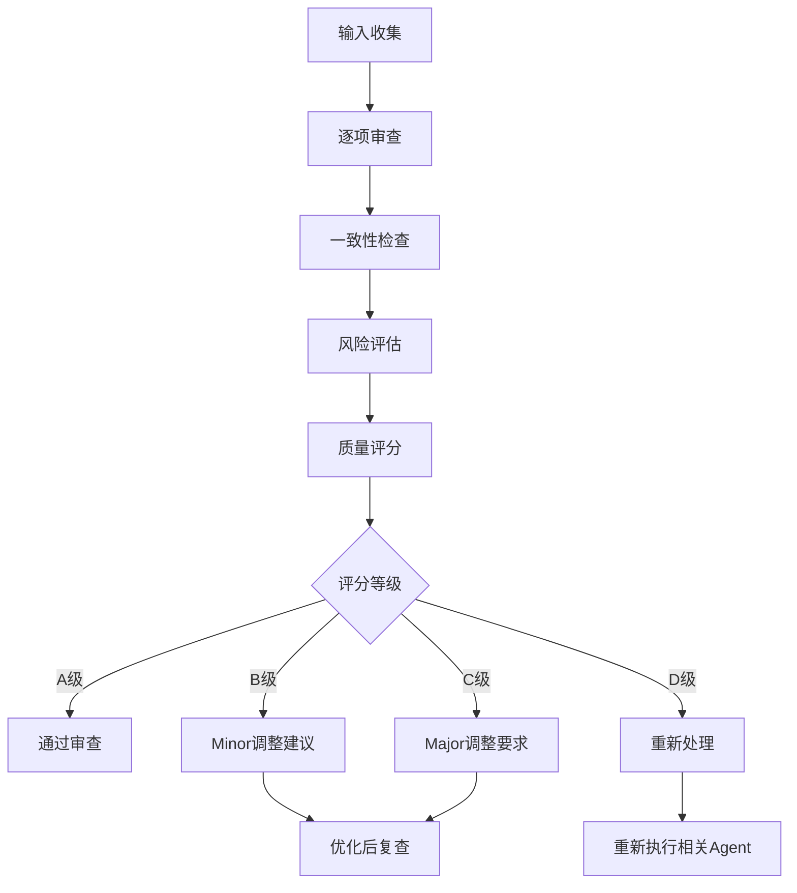

# SuitAgent 质量审查标准与检查清单

## 文档信息

- **版本**: 1.0
- **创建日期**: 2025-11-01
- **最后更新**: 2025-11-01
- **适用范围**: SuitAgent系统所有Agent输出质量审查

---

## 1. 总体质量标准

### 1.1 质量分级体系

| 等级 | 分数范围 | 质量描述 | 处置方式 |
|------|----------|----------|----------|
| **A级（优秀）** | 90-100分 | 完全符合标准，可直接使用 | ✅ 直接通过 |
| **B级（良好）** | 80-89分 | 基本符合标准，需minor调整 | ⚠️ 建议优化后使用 |
| **C级（需改进）** | 70-79分 | 存在明显问题，需major调整 | ❌ 必须修改后使用 |
| **D级（不合格）** | <70分 | 存在严重错误，需重新处理 | 🚫 禁止使用，重新处理 |

### 1.2 全局审查维度

```yaml
审查维度:
  1. 准确性 (Accuracy):
     - 法律适用准确性
     - 事实描述准确性
     - 数据计算准确性
     - 引用格式准确性

  2. 完整性 (Completeness):
     - 必要要素完整性
     - 逻辑链条完整性
     - 文档结构完整性
     - 信息覆盖完整性

  3. 一致性 (Consistency):
     - 跨Agent数据一致
     - 时间逻辑一致
     - 引用编号一致
     - 表述风格一致

  4. 可行性 (Feasibility):
     - 策略方案可执行
     - 时间安排可实现
     - 成本预算可控制
     - 建议措施可落实

  5. 合规性 (Compliance):
     - 符合法律法规
     - 符合行业规范
     - 符合法院要求
     - 符合伦理标准
```

---

## 2. Agent专项审查标准

## 2.1 DocAnalyzer（文档分析器）审查标准

### 2.1.1 OCR识别质量标准

| 检查项 | 要求 | 评分标准 | 不合格判定 |
|--------|------|----------|------------|
| 文字识别准确率 | > 95% | 98-100分：A级，95-97分：B级 | < 95% |
| 数字识别准确率 | > 98% | 100分：A级，98-99分：B级 | < 98% |
| 关键字段准确率 | 100% | 100分：A级，95-99分：C级 | < 95% |
| 置信度 | > 90% | 所有内容置信度 > 90% | 任何内容 < 90% |

### 2.1.2 要素提取完整性清单

- [ ] **案号提取**
  - [ ] 格式符合规范：`[YYYY]省[城市]民初/行初/刑初[序号]号`
  - [ ] 年份合理性（不超过当前年份+1）
  - [ ] 法院代码有效性
  - [ ] 案件类型匹配

- [ ] **当事人信息**
  - [ ] 姓名完整准确
  - [ ] 地址详细完整
  - [ ] 身份证号格式正确
  - [ ] 当事人角色明确

- [ ] **诉讼请求**
  - [ ] 请求事项具体明确
  - [ ] 金额数字与大写一致
  - [ ] 请求逻辑合理
  - [ ] 未超过诉讼时效

### 2.1.3 文档类型识别准确性

| 文档类型 | 必有关键词 | 置信度要求 | 验证方式 |
|----------|------------|------------|----------|
| 起诉状 | "原告"、"被告"、"诉讼请求" | > 95% | 关键词匹配+结构验证 |
| 答辩状 | "答辩"、"反驳" | > 95% | 关键词匹配 |
| 证据材料 | "证据"、"证明目的" | > 95% | 关键词匹配 |
| 庭审笔录 | "审判员"、"庭审" | > 95% | 关键词匹配 |

**审查通过标准**: 所有必有关键词匹配，置信度 > 95%

---

## 2.2 EvidenceAnalyzer（证据分析器）审查标准

### 2.2.1 三性质证完整性检查清单

- [ ] **真实性质证**
  - [ ] 证据来源真实性分析
  - [ ] 证据内容真实性分析
  - [ ] 技术手段真实性验证
  - [ ] 疑点标记和说明

- [ ] **合法性质证**
  - [ ] 证据形式合法性检查
  - [ ] 取得方式合法性检查
  - [ ] 程序合规性检查
  - [ ] 合法性风险提示

- [ ] **关联性质证**
  - [ ] 与争议事实关联性
  - [ ] 与其他证据关联性
  - [ ] 证明目的明确性
  - [ ] 证明力强度评估

**审查标准**: 三性质证100%覆盖，每个性质分析不少于200字

### 2.2.2 证据目录规范性检查清单

- [ ] **格式规范**
  - [ ] 符合法院标准格式
  - [ ] 序号连续完整（1、2、3...）
  - [ ] 证据编号规范（证据1、证据2...）
  - [ ] 页码标注正确

- [ ] **内容完整**
  - [ ] 证据名称完整准确
  - [ ] 证据来源清楚
  - [ ] 证明目的明确
  - [ ] 证据份数准确

- [ ] **逻辑一致**
  - [ ] 目录与实际证据一致
  - [ ] 编号与文书引用一致
  - [ ] 证明目的与诉讼请求匹配
  - [ ] 证据顺序逻辑合理

**审查通过标准**: 所有检查项100%符合

---

## 2.3 Strategist（策略规划器）审查标准

### 2.3.1 SWOT分析质量检查清单

- [ ] **优势分析**
  - [ ] 基于实际证据和案例事实
  - [ ] 避免主观臆断
  - [ ] 与法律研究结果匹配
  - [ ] 量化为风险评分（0-100分）

- [ ] **劣势分析**
  - [ ] 识别证据薄弱环节
  - [ ] 评估法律适用难点
  - [ ] 分析对方可能的优势
  - [ ] 量化风险等级

- [ ] **机会分析**
  - [ ] 基于法律变化和政策趋势
  - [ ] 关注程序性机会
  - [ ] 评估和解或调解可能性
  - [ ] 量化机会价值

- [ ] **威胁分析**
  - [ ] 识别外部法律风险
  - [ ] 评估对方资源和能力
  - [ ] 关注时间和成本压力
  - [ ] 量化威胁影响

**审查标准**: SWOT四个维度100%覆盖，数据支撑充分

### 2.3.2 风险评估准确性检查

| 风险类型 | 计算方法 | 要求精度 | 审查标准 |
|----------|----------|----------|----------|
| 败诉风险 | 类案胜率 × 当前案件强度 | 准确性 > 85% | 基于 > 30个案例，3年内数据 |
| 执行风险 | 对方履行能力评估 | 准确性 > 80% | 有财产调查依据 |
| 时间成本 | 类案平均周期 | 误差 < 20% | 参考法院公开数据 |
| 费用成本 | 详细费用清单 | 误差 < 10% | 包含所有可能费用 |

**审查通过标准**: 所有风险类型评估准确率达标

---

## 2.4 Writer（法律文书起草者）审查标准

### 2.4.1 格式规范100%检查清单

- [ ] **标题格式**
  - [ ] 文书标题居中
  - [ ] 使用标准字体（如方正小标宋_GBK二号）
  - [ ] 标题与内容间距正确

- [ ] **当事人信息格式**
  - [ ] 姓名格式规范（2-4个汉字）
  - [ ] 地址格式完整（省市区街道详细地址）
  - [ ] 身份证号格式正确
  - [ ] 当事人角色标注清楚

- [ ] **正文格式**
  - [ ] 段落编号正确（一、（一）、1.、（1））
  - [ ] 行间距统一（一般为1.5倍行距）
  - [ ] 页边距符合要求（上3.7cm，下3.5cm，左右各2.8cm）
  - [ ] 页码格式正确（居中，格式"第X页共Y页"）

- [ ] **结尾格式**
  - [ ] "此致"居右
  - [ ] 法院名称居右
  - [ ] "具状人："居右
  - [ ] 签名和时间格式正确

**审查标准**: 格式规范度必须达到100%

### 2.4.2 法律逻辑严密性检查

- [ ] **事实与法律依据匹配**
  - [ ] 每项诉讼请求有对应事实支撑
  - [ ] 每项事实有对应法律依据
  - [ ] 事实与法律适用逻辑清晰

- [ ] **论证链条完整**
  - [ ] 观点 → 论证 → 结论的逻辑链条完整
  - [ ] 无逻辑跳跃或断裂
  - [ ] 论据充分支持论点

- [ ] **争议焦点回应**
  - [ ] 对所有争议焦点逐一回应
  - [ ] 回应方式明确（有针对性的反驳）
  - [ ] 回应逻辑清晰

**审查标准**: 逻辑严密性评分 > 95%

---

## 2.5 Researcher（法律研究者）审查标准

### 2.5.1 法条适用准确性检查

| 检查项 | 要求 | 评分标准 |
|--------|------|----------|
| 法条编号 | 准确无误 | 错误1处：C级，错误>1处：D级 |
| 条文引用 | 完整引用（条、款、项） | 完整100分，不完整降级 |
| 生效时间 | 法条现行有效 | 失效法条引用直接D级 |
| 适用性 | 与争议焦点对应 | 不对应：C级 |

### 2.5.2 判例研究质量检查清单

- [ ] **判例相关性**
  - [ ] 判例与争议问题直接相关
  - [ ] 判例事实与本案相似度高
  - [ ] 判例法院层级相当

- [ ] **判例时效性**
  - [ ] 判决时间不超过3年
  - [ ] 未被推翻或撤销
  - [ ] 仍具有指导意义

- [ ] **适用路径清晰**
  - [ ] 法律适用路径明确
  - [ ] 多种观点平衡分析
  - [ ] 倾向性意见有充分理由

**审查标准**: 法条引用100%准确，判例引用相关性 > 90%

---

## 2.6 IssueIdentifier（争议识别器）审查标准

### 2.6.1 争议焦点完整性检查清单

- [ ] **焦点识别完整性**
  - [ ] 所有争议焦点都已识别
  - [ ] 争议焦点表述准确
  - [ ] 争议焦点不重复

- [ ] **焦点归类准确性**
  - [ ] 事实争议与法律争议区分
  - [ ] 程序争议与实体争议区分
  - [ ] 重要焦点与次要焦点区分

- [ ] **优先级排序合理性**
  - [ ] 主要争议优先
  - [ ] 影响判决结果的优先
  - [ ] 证据支持的充分性排序

**审查标准**: 争议焦点识别率 > 95%

---

## 2.7 Summarizer（摘要生成者）审查标准

### 2.7.1 信息提炼质量检查清单

- [ ] **关键信息完整性**
  - [ ] 案件基本信息完整
  - [ ] 争议焦点提炼准确
  - [ ] 关键事实突出
  - [ ] 重要结论明确

- [ ] **逻辑结构清晰**
  - [ ] 摘要结构合理（背景-问题-结论）
  - [ ] 逻辑层次分明
  - [ ] 前后逻辑一致

- [ ] **摘要长度合理**
  - [ ] 不超过原文10%
  - [ ] 不少于原文5%
  - [ ] 核心信息不缺失

**审查标准**: 信息覆盖率 > 95%，结构清晰度 > 90%

---

## 2.8 Reporter（报告整合者）审查标准

### 2.8.1 报告质量检查清单

- [ ] **内容整合完整性**
  - [ ] 所有Agent输出都已整合
  - [ ] 整合逻辑清晰
  - [ ] 无遗漏重要内容

- [ ] **结构逻辑清晰**
  - [ ] 报告结构完整（摘要-正文-结论）
  - [ ] 章节划分合理
  - [ ] 过渡自然流畅

- [ ] **格式规范统一**
  - [ ] 符合报告格式规范
  - [ ] 字体字号统一
  - [ ] 图表编号规范
  - [ ] 引用格式统一

**审查标准**: 内容完整性100%，格式规范性100%

---

## 2.9 Scheduler（日程规划者）审查标准

### 2.9.1 期限管理准确性检查

| 检查项 | 要求 | 错误容忍 |
|--------|------|----------|
| 法定期限计算 | 准确无误 | 0容忍 |
| 工作日计算 | 准确 | 节假日特殊处理 |
| 关键节点标注 | 清晰明确 | 遗漏关键节点不可接受 |
| 预警机制 | 有效 | 预警时间合理（提前5-7天） |

**审查标准**: 期限计算准确率 > 98%

---

## 3. 跨Agent一致性检查

## 3.1 数据一致性检查清单

### 3.1.1 案号一致性
- [ ] DocAnalyzer提取的案号与所有Agent使用一致
- [ ] Scheduler中的期限计算基于同一案号
- [ ] Writer文书中的案号与DocAnalyzer一致

### 3.1.2 当事人信息一致性
- [ ] 当事人姓名在所有输出中一致
- [ ] 当事人地址在所有输出中一致
- [ ] 当事人角色标注一致

### 3.1.3 证据引用一致性
- [ ] EvidenceAnalyzer的证据编号与Writer引用一致
- [ ] 证据目录与实际文书引用一致
- [ ] 证明目的与诉讼请求对应

### 3.1.4 时间逻辑一致性
- [ ] 案件时间线在所有输出中一致
- [ ] 期限计算与时间线匹配
- [ ] 策略安排与时间线匹配

**审查标准**: 发现任何不一致即为C级或以下

---

## 3.2 逻辑一致性检查清单

### 3.2.1 争议焦点与法律研究一致性
- [ ] IssueIdentifier识别的争议焦点与Researcher研究范围一致
- [ ] Strategist的策略与Researcher的法律路径一致
- [ ] Writer的文书与Researcher的法条引用一致

### 3.2.2 证据分析与策略一致性
- [ ] EvidenceAnalyzer的证据分析支持Strategist的优势分析
- [ ] 证据风险与Strategist的风险评估一致
- [ ] 补充建议与Strategist的资源配置一致

**审查标准**: 逻辑不一致直接判定为C级或以下

---

## 4. 触发规则引擎配置

## 4.1 自动触发规则

### 4.1.1 案件风险等级触发

```yaml
A级风险（自动触发Reviewer）:
  - 案件标的额 > 100万元
  - 涉及三方以上当事人
  - 新型法律问题（无直接判例）
  - 社会影响重大的案件
  - 二审或再审案件

B级风险（自动触发Reviewer）:
  - 案件标的额 50-100万元
  - 涉及专业性较强的法律问题
  - 证据复杂的案件
  - 时效紧急的案件

C级风险（可选触发Reviewer）:
  - 案件标的额 10-50万元
  - 常规但有一定复杂度的案件
  - 用户明确要求审查
```

### 4.1.2 文书类型触发

```yaml
高重要性文书（自动触发）:
  - 上诉状
  - 代理词
  - 质证意见书
  - 法律意见书
  - 对外提交的所有文书

中重要性文书（建议触发）:
  - 答辩状
  - 申请书
  - 保全申请
  - 执行申请

低重要性文书（可选触发）:
  - 内部工作文档
  - 客户沟通记录
  - 工作总结报告
```

## 4.2 质量异常触发

### 4.2.1 前置Agent质量触发

```yaml
自动触发条件:
  - 前置Agent输出质量评分 < B级
  - 置信度 < 90%
  - 出现致命错误或重要错误
  - 交叉验证发现不一致
```

## 4.3 手动触发规则

### 4.3.1 用户主动触发

```yaml
触发方式:
  - 明确指令："请进行质量审查"
  - 通过API参数："review_required": true
  - 通过配置文件设置全局审查模式
```

---

## 5. 审查工作流

## 5.1 标准审查流程



## 5.2 审查周期时间要求

| 审查类型 | 目标时间 | 最长时间 | 质量保证措施 |
|----------|----------|----------|-------------|
| Writer审查 | 2分钟 | 5分钟 | 格式自动检查+人工确认 |
| Strategist审查 | 3分钟 | 7分钟 | 数据交叉验证 |
| 全流程审查 | 5分钟 | 10分钟 | 多维度综合评估 |
| 最终审查（Reporter前） | 3分钟 | 8分钟 | 全局一致性检查 |

---

## 6. 持续改进机制

## 6.1 质量指标监控

### 6.1.1 关键指标

```yaml
质量指标:
  1. 审查准确率:
     - 定义：被审查后实际质量与审查结果一致的比例
     - 目标：> 95%
     - 监控：每月统计

  2. 建议采纳率:
     - 定义：审查建议被采纳并实施的比例
     - 目标：> 80%
     - 监控：每月统计

  3. 误判率:
     - 定义：审查结果与实际不符的比例
     - 目标：< 5%
     - 监控：每月统计

  4. 审查效率:
     - 定义：平均审查时间
     - 目标：< 5分钟
     - 监控：每周统计
```

## 6.2 反馈收集机制

### 6.2.1 用户反馈

- 满意度调查（1-5分）
- 建议采纳情况跟踪
- 质量问题案例收集
- 审查体验访谈

### 6.2.2 内部反馈

- Agent输出质量跟踪
- 审查结果准确性统计
- 误判案例分析
- 流程优化建议

## 6.3 知识库更新

### 6.3.1 更新频率

- **月度更新**：审查标准微调
- **季度更新**：审查流程优化
- **年度更新**：标准体系升级

### 6.3.2 更新内容

- 审查标准调整
- 新增检查项
- 权重调整
- 评分标准优化

---

## 7. 附录

## 7.1 常用审查检查表模板

### 7.1.1 文书质量审查清单（Writer）

```
文书质量审查检查表
├── 格式规范（100分）
│   ├── 标题格式 □
│   ├── 当事人信息 □
│   ├── 段落编号 □
│   ├── 页边距 □
│   ├── 字体字号 □
│   └── 结尾格式 □
├── 内容质量（100分）
│   ├── 事实描述 □
│   ├── 法律适用 □
│   ├── 争议焦点回应 □
│   ├── 诉讼请求明确 □
│   └── 逻辑严密性 □
└── 引用规范（100分）
    ├── 法条引用 □
    ├── 证据引用 □
    ├── 判例引用 □
    └── 格式规范 □

总分：___/300  等级：___
```

## 7.2 质量评分计算公式

### 7.2.1 单Agent评分

```
Agent评分 = Σ(检查项得分 × 权重) / Σ权重

例如：
Writer评分 = (格式规范 × 0.4 + 内容质量 × 0.4 + 引用规范 × 0.2)

A级：90-100分
B级：80-89分
C级：70-79分
D级：< 70分
```

### 7.2.2 全局评分

```
全局评分 = Σ(Agent评分 × Agent权重) / Σ权重

Agent权重分配：
- Writer: 0.25（核心输出）
- Strategist: 0.20（决策关键）
- DocAnalyzer: 0.15（基础数据）
- EvidenceAnalyzer: 0.15（关键证据）
- 其他Agent: 0.05（辅助支持）
```

---

## 8. 版本记录

### 版本历史

| 版本 | 日期 | 修改内容 | 修改人 |
|------|------|----------|--------|
| 1.0 | 2025-11-01 | 初始版本，创建完整审查标准体系 | 架构团队 |

### 未来计划

- [ ] 根据实际使用情况调整评分权重
- [ ] 增加更多专业领域的审查标准
- [ ] 引入机器学习优化审查准确率
- [ ] 建立审查质量基准数据库

---

**文档结束**

本标准将根据实际使用情况和用户反馈持续更新优化。
